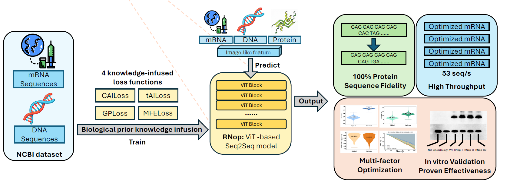
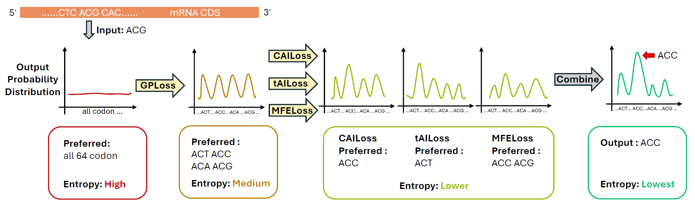

# RNop: Knowledge-Infused Transformer for mRNA Optimization

RNop is a knowledge-infused Transformer that integrates four mechanism-aligned losses to address the "impossible triangle" of mRNA optimization. This repository provides the implementation for mRNA sequence optimization using deep learning.

## Overview

mRNA optimization is essential for mRNA vaccines, therapies, and industrial protein production. Based on current explorations, an ideal optimization approach should simultaneously:

1. **Prevent unintended amino-acid changes** - maintain absolute sequence fidelity
2. **Optimize multiple, biologically relevant objectives** - improve expression and other key metrics
3. **Retain computational efficiency** - enable high-throughput processing

However, existing methods are forced to trade off between these perspectives on mRNA optimization, forming an **"impossible triangle"**. RNop resolves this challenge by encoding biological prior knowledge through four mechanism-aligned loss functions, making knowledge infusion explicit and enabling controllable adjustments across optimization focus. However, we propose a new knowledge-infused deep learning method to achieve all factors concurrently.*


*Figure (a): **The conceptualization of RNop**: Our methods include 4 knowledge-infused loss functions leveraging biological prior knowledge. RNop can process various sequences through a ViT-based Sequence-to-Sequence architecture. The optimized sequences exhibit great expression improvements in both computerized and biological experiments.*

## Key Features

- **Absolute Sequence Fidelity**: Ensures no unintended amino-acid changes in optimized sequences
- **Knowledge-Infused Architecture**: Four mechanism-aligned losses leveraging biological prior knowledge
- **ViT-based Sequence-to-Sequence**: Processes various sequences through a Vision Transformer-based architecture
- **High Throughput**: Computational efficiency enables rapid optimization
- **Interpretability**: Loss ablation studies reveal mechanism-level interpretability
- **Validated Performance**: 
  - *In silico* analyses on over 6 million sequences show significantly improved biological metrics
  - *In vitro* validation demonstrates up to **2.28-fold expression gain**

## How RNop Works

RNop transforms the "black-box" mRNA design into a predictable and explainable engineering problem through explicit and interpretable knowledge infusion. By encoding biological prior knowledge in the loss functions, RNop reduces information entropy and provides preferred codon selections for specific species.


*Figure (b): **Effect of infused Knowledge**. After the input process, each codon has a probability space spanning the whole vocabulary. The infused knowledge helps RNop models reduce the information entropy, providing the preferred codon for the input codon in specific species. The output is the optimal, synonymous codon.*

Extendive expriments have been conduncted to prove the effectiveness of our method: RNop is multi-factor, multi-spieces, high-fidelity, and high throughput mRNA optimization method!

## Structure

```
RNA-loss-github-togo/
├── RNA_opt/              # Main package
│   ├── test.py          # Test/inference entry point
│   ├── model/           # Model definitions
│   │   ├── arch/        # Network architectures
│   │   ├── loss/        # Loss functions (basic implementations only)
│   │   ├── metrics/     # Evaluation metrics
│   │   └── RPLoss/      # RNA-specific loss functions (placeholders)
│   └── data/            # Data loading utilities
├── options/             # Configuration YAML files
├── pretrained_weights/  # Place pre-trained model weights here
├── resources/           # Resources including figures
│   └── imgs/           # Images for documentation
├── requirements.txt     # Python dependencies
├── README.md           # This file
└── LICENSE             # MIT License
```

## Requirements

- Python 3.10+ (3.12 recommended)
- PyTorch
- PyYAML
- NumPy
- To see full requirements, refer to the "requirements.txt"

## Usage

1. Install dependencies:
   ```bash
   pip install -r requirements.txt
   ```

2. Place your pre-trained model weights in the `pretrained_weights/` directory. Download the pretrained loss weights from: [Google Drive](https://drive.google.com/file/d/1RkJ-U22sH4z2_vWHPW8EeFtkkbaOE6Nf/view?usp=drive_link)

3. Update the configuration file `options/test_rnaopt.yml`:
   - Set the path to your test data in `datasets.test.txt_path`
   - Set the path to your pre-trained model in `path.pretrain_network_g`

4. Run inference:
   ```bash
   python RNA_opt/test.py -opt options/test_rnaopt.yml
   ```

## Contributions and Future Development

RNop provides a modular approach to the mRNA design process amenable to future development of additional priors. The framework can be adapted for other fields of biological research where knowledge-infused optimization is beneficial. If you have any suggestion, please leave your comment or open an issue.

## License

See LICENSE file for details (MIT License).

## Citation

If you find this repo useful for your work, please cite:

```
@misc{gong2025newdeeplearningbasedapproachmrna,
      title={A New Deep-learning-Based Approach For mRNA Optimization: High Fidelity, Computation Efficiency, and Multiple Optimization Factors}, 
      author={Zheng Gong and Ziyi Jiang and Weihao Gao and Deng Zhuo and Lan Ma},
      year={2025},
      eprint={2505.23862},
      archivePrefix={arXiv},
      primaryClass={q-bio.QM},
      url={https://arxiv.org/abs/2505.23862}, 
}
```
